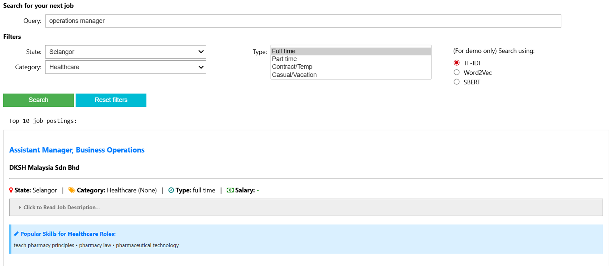

# Job Intelligence System for Enhanced Candidate Matching and Skill Insights

## Introduction
This is a group project for ISSS609 Text Analytics Course.   

The objective of the project is to leverage text analytics techniques to recommend relevant job postings to job seekers and provide insights on in-demand skills for major job categories. This recommendation pipeline consists of 3 major modules:
* Document Classification: Supervised ML model to automatically categorize postings into standardized taxonomy (i.e. major job categories)
* Topic Modelling: Identify key and emerging skills relevant to each job cluster
* Document Retrieval: Semantic matching to connect job seekers to desired positions

## Dataset Used
* JobStreet (Malaysia) Job Postings from Kaggle
* https://www.kaggle.com/datasets/azraimohamad/jobstreet-all-job-dataset

## Technologies Used
Programming language
* Python

Text Analytics techniques applied:   
Document Classification
* Decision Tree
* Random Forest
* Logistic Regression (LR) with TF-IDF & Word2Vec embeddings
* DistilBERT

Topic Modelling
* Latent Dirichlet Allocation (LDA)
* BERTopic

Document Retrieval
* TF-IDF, Word2Vec, SBERT embeddings
* Cosine similarity
* Fuzzy matching / Levenshtein distance for Named Entity Recognition (NER)
* Query expansion
* Creation of inverted index

## Final Product Created
* Front End interactive user interface where user can type in query
* Filter results by categorical filters, or company name (if mentioned in query)
* Display in-demand skills related to the industry of the job posting result
* Built using ipywidgets

Refer to Jupyter notebooks for details.